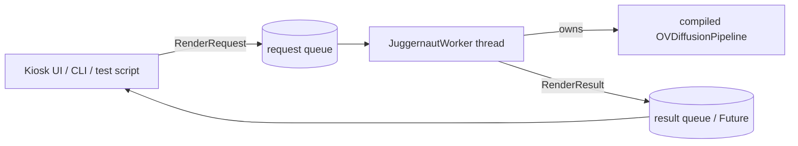
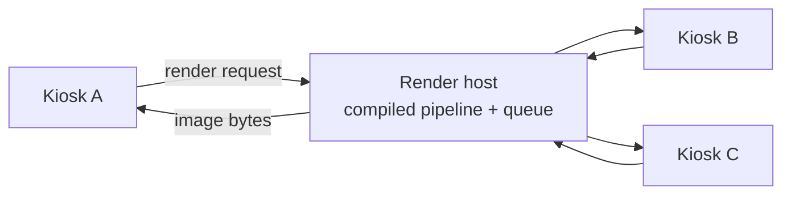

# vPRO Photo Booth — Performance Optimization Plan

Status: Phase 0 (instrumentation) complete — see §10. Phase 1 not started.
Branch: `feature/persistent-juggernaut-runner`

> **Phase 0 headline:** the ~350 s startup was **not** an OpenVINO cost. It was ~337 s of blocked
> network calls (Hugging Face Hub metadata lookups plus OpenVINO telemetry) timing out on a machine
> that cannot reach them. Disabling both cut startup from **359.6 s to 17.8 s — a 20× win — before
> any architectural work.** Details and the fix are in §10.

## 1. Problem statement

Every invocation of `tests/juggernaut_test.py` (and the equivalent CLI paths in
[src/vpro/cli.py](src/vpro/cli.py)) constructs the OpenVINO Juggernaut pipeline from scratch:

1. Python process start + `optimum.intel` / `torch` / `diffusers` import cost.
2. `OVDiffusionPipeline.from_pretrained(...)` reads model metadata and IR files from disk.
3. Each component (`unet`, `vae_decoder`, `vae_encoder`, `text_encoder`, `text_encoder_2`) is
   compiled for the GPU plugin and blobs are paged onto the device.

That fixed cost was originally measured at **~360 s**, against generation of only **~46–55 s** at
the `quality` preset (36 steps, 1080×1350) per [outputs/juggernaut_test_log.txt](outputs/juggernaut_test_log.txt)
— i.e. ~88% of a session was setup.

**Phase 0 changed this picture completely.** After the §10 fix, startup is **17.8 s** and the split
is roughly 9.3 s of Python imports plus 7.9 s of component compile. Startup is no longer the
dominant cost; the render is. The persistent runner (§2) is still worth building — it removes that
17.8 s from every guest after the first — but it is now an optimization, not a rescue.

### Two different caches — do not conflate them

| | OpenVINO `CACHE_DIR` (on disk) | Compiled pipeline (in memory) |
| --- | --- | --- |
| Written | Once, on first compile | Once, per process launch |
| Read | Once **per process launch** | Never re-read; it is already resident |
| Survives process exit | Yes | **No** |
| Saves | Recompilation of IR → GPU kernels | Everything: imports, disk read, weight upload, compile |
| Relevant to renders 2..N in one process | **No** | Yes — they cost nothing |

The disk cache does *not* make later renders faster. Within one process, renders 2..N never consult
it — the model is already compiled and resident on the GPU. The disk cache only shortens the
*startup* of each new process, and even then it only removes recompilation; the Python imports, the
blob read from disk, and the weight upload to the GPU are still paid every single launch.

That is the whole argument for §2: the only way to stop paying startup is to stop starting up.

### Goal

| | OpenVINO `CACHE_DIR` (on disk) | Compiled pipeline (in memory) |
| --- | --- | --- |
| Written | Once, on first compile | Once, per process launch |
| Read | Once **per process launch** | Never re-read; it is already resident |
| Survives process exit | Yes | **No** |
| Saves | Recompilation of IR → GPU kernels | Everything: imports, disk read, weight upload, compile |
| Relevant to renders 2..N in one process | **No** | Yes — they cost nothing |

The disk cache does *not* make later renders faster. Within one process, renders 2..N never consult
it — the model is already compiled and resident on the GPU. The disk cache only shortens the
*startup* of each new process, and even then it only removes recompilation; the Python imports, the
blob read from disk, and the weight upload to the GPU are still paid every single launch.

That is the whole argument for §2: the only way to stop paying startup is to stop starting up.

### Goal

Pay the pipeline construction cost exactly once per kiosk boot, then serve each guest request
against the already-compiled, already-resident pipeline. Target steady-state guest latency ≈ render
time only.

| Scenario | Before Phase 0 | After Phase 0 fix | After §2 runner |
| --- | --- | --- | --- |
| First render after boot | ~400 s | ~60 s | ~60 s (hidden behind attract screen) |
| Each subsequent render | ~400 s | ~60 s | **~43 s (render only)** |
| 10 guests in a row | ~67 min | ~10 min | ~7.4 min |

Measured at the `quality` preset (36 steps, 1080×1350): startup **17.3 s**, render **42.0 / 41.9 /
44.0 s** (mean 42.7 s). The runner removes the 17.3 s, not part of the 42.7 s — those are separate,
additive costs. Getting below ~40 s requires §4 (fewer steps or a better scheduler), not §2.

---

## 2. Primary optimization — persistent Juggernaut runner

### 2.1 Concept

Introduce a long-lived **generation worker** that owns the compiled pipeline object and consumes
render requests from a queue. Callers (test harness, CLI, kiosk UI) submit a request and await a
result instead of building a pipeline.



### 2.2 Scope for this phase — in-process worker thread only

Walk before running. The entire win we are chasing is *pay the load cost once*, and that does not
require a network, a protocol, or a second process. Keep it to one process:

- A `JuggernautRunner` holds the pipeline plus a `queue.Queue` of requests.
- A daemon thread runs the render loop; callers submit and get a `concurrent.futures.Future`.
- Warmup starts at application launch (kiosk boot) rather than at first guest.
- Works immediately for the kiosk app, where UI and generation already share one process.

Known limitation, accepted for now: this does **not** help `tests/juggernaut_test.py` across
invocations, since that is one process per run. To measure the win, exercise the runner with the
existing `--runs N` flag against a single runner instance — that is enough to prove renders 2..N
skip the setup cost entirely. Cross-process and cross-machine reuse are deferred to §9.

Design constraint that keeps the door open: callers talk to the runner through a small
submit/await interface and never touch the pipeline object directly. If a server wrapper is added
later, it wraps the same runner and nothing upstream changes.

### 2.3 Proposed module layout

| File | Responsibility |
| --- | --- |
| `src/vpro/vision/juggernaut_runner.py` | `JuggernautRunner`: owns pipeline, warmup, request loop, thread lifecycle |
| `src/vpro/vision/juggernaut_types.py` | `RenderRequest` / `RenderResult` dataclasses |

`juggernaut_runtime.py` stays as-is and becomes the low-level implementation the runner calls. No
behavior change to `load_juggernaut_pipeline` / `render_text2img` / `render_img2img`.

### 2.4 Request/result contract (draft)

Plain dataclasses — no serialization needed while everything is in one process. Keep them
serialization-*friendly* (flat, primitive fields) so a wire format is a later addition rather than
a rewrite.

```python
@dataclass(frozen=True)
class RenderRequest:
    mode: str                             # "text2img" | "img2img"
    prompt: str
    negative_prompt: str | None
    steps: int
    guidance_scale: float
    width: int
    height: int
    output_path: Path
    seed: int | None = None
    strength: float | None = None         # img2img only
    input_image_path: Path | None = None  # img2img only


@dataclass(frozen=True)
class RenderResult:
    ok: bool
    output_path: Path | None
    render_seconds: float
    queue_wait_seconds: float
    error: str | None = None
```

Plus a small status surface on the runner: `state` (`loading` / `compiling` / `ready` /
`rendering` / `failed`), `model_id`, `device`, `uptime`, `renders_served`.

### 2.5 Lifecycle and safety concerns

- **Serialize renders.** One GPU, one compiled pipeline. The worker processes requests strictly one
  at a time; concurrent `pipeline(...)` calls on the same OpenVINO compiled model are not safe to
  assume. Bound the queue depth and reject over-capacity requests fast.
- **Readiness gating.** Callers must be able to distinguish "still compiling" from "failed" so the
  kiosk shows a meaningful message instead of hanging. Submitting before ready should block with a
  known state or raise — never silently queue forever.
- **Cancellation.** A guest walking away mid-render should not block the queue. Minimum viable:
  mark the request abandoned and discard the result. Real mid-diffusion cancellation needs a
  `callback_on_step_end` hook that raises — worth implementing since a 46 s render is long enough
  for a guest to leave.
- **Crash recovery.** If a render raises, the worker must return an error result and keep the
  pipeline alive rather than dying. A worker thread that dies silently is the worst outcome — the
  UI would wait forever. If the pipeline itself is corrupted (device lost, driver reset), the runner
  should transition to a `reloading` state and rebuild once.
- **Memory drift.** Long-running processes with repeated large tensor allocations can fragment.
  Track `renders_served` and consider a recycle threshold (e.g. rebuild after N hundred renders
  during an event) — measure before enabling.
- **Input validation.** Even in-process, cap `steps`, `width`, `height`, and prompt length so a bad
  UI value cannot wedge the booth on a multi-minute render.
- **Clean shutdown.** CTRL-C / app exit should abandon or drain the in-flight render, join the
  thread, and release the compiled model so the GPU is freed for the next launch. Daemon thread plus
  an explicit sentinel in the queue.
- **Do not leak the pipeline object.** Callers that grab the pipeline and invoke it directly
  reintroduce exactly the concurrency hazard the queue exists to prevent.

### 2.6 Migration path for callers

- `cli.py` `_run_juggernaut_tests` and the social pipeline path acquire the runner instead of
  calling `load_juggernaut_pipeline` directly.
- `tests/juggernaut_test.py` builds one runner and submits `--runs N` requests through it, which is
  how we demonstrate the win.
- No signature changes to existing render functions — lower merge risk.

### 2.7 Validation

- Log `startup_seconds` once, then per-request `queue_wait_seconds` and `render_seconds`, appended
  to the existing run log format so old and new runs stay comparable.
- **Acceptance: renders 2..N in a single process must average within ~10% of the current measured
  render time (~46–55 s), with zero pipeline reconstruction in the logs.** That is the whole point
  of this phase.
- Soak test: 50 sequential renders, assert no monotonic latency growth and no unbounded RSS growth.

---

## 3. Reduce the one-time startup cost (~17.8 s after the §10 fix)

> **Superseded by §10.** This section was written against a 350 s startup that turned out to be
> network stalls. The items below now target 17.8 s, of which ~9.3 s is Python import and ~7.9 s is
> component compile. Kept for reference; low priority.

1. ~~Verify the compiled-model cache is hitting.~~ Confirmed working (§10) — 203 → 203 blobs.
2. **Pin static shapes.** Kiosk output is fixed at 1080×1350 and batch 1. Reshaping before compile
   may improve per-step throughput on Intel GPU, at the cost of arbitrary resolutions. The
   *throughput* argument now matters more than the compile-time one.
3. **Export a fully-optimized local model directory once.** Ship a pre-converted, pre-reshaped IR
   in `models/juggernaut/` instead of resolving from the HF cache. Also removes any remaining
   dependence on Hub resolution, which is what caused §10.
4. **Trim import cost.** At 9.3 s, `optimum.intel` import is now the single largest startup item.
   `torch` is imported only to build a seeded generator; a numpy-based latent seed may let the
   OpenVINO path skip it. Check whether `optimum.intel` pulls torch in regardless.
5. **Compile components in parallel.** 7.9 s total, dominated by `unet` (4.9 s). Small win at best.
6. **Warm the cache during provisioning.** Still worth doing so a first-ever boot at a venue does
   not pay a cold compile.

## 4. Reduce per-render cost (~42 s at `quality`, ~1.18 s/step)

Now the dominant cost per guest, and the only lever that gets a session under ~40 s.

1. **Step count is the dominant lever.** Render time is almost exactly linear in steps at
   ~1.18 s/step. Measured: `quality` 36 steps ≈ 42 s; `fast` 16 steps ≈ 17–22 s. `balanced`
   24 steps should land ≈ 28 s. Run a fixed-seed side-by-side and decide whether 36 steps is
   visibly better at the delivered output size — this is the cheapest 33% available.
2. **Guidance batching.** CFG > 1 typically doubles UNet work (conditional + unconditional).
   Consider whether the model supports a distilled/turbo path or a lower CFG with fewer steps.
3. **Scheduler choice.** Higher-order schedulers (DPM++ 2M Karras and similar) often reach
   equivalent quality in fewer steps than the default. Cheap to test, potentially large win.
4. **Resolution strategy.** Generate at a native-friendly SDXL resolution and upscale to
   1080×1350 with Lanczos (already the fallback path in `render_text2img`) rather than generating
   at the exact odd size. Compare quality honestly before adopting.
5. **Precision / device config.** Evaluate `INFERENCE_PRECISION_HINT`, throughput vs. latency
   performance hints, and NPU offload for the text encoders if the platform exposes one.
6. **Cache text-encoder output.** Prompts are built from a small fixed scene set plus a constant
   style suffix and a constant negative prompt. Prompt embeddings for those combinations can be
   computed once at warmup and reused, skipping both text encoders per render.

## 5. Perceived-latency wins (often cheaper than real speedups)

1. **Speculative pre-render — only if the architecture changes.** *Not possible as currently built:*
   `_run_social_pipeline` runs img2img guided by the composed portrait, so the render cannot start
   until the guest is captured and composed. Pre-rendering requires switching to "generate
   background with text2img, then composite the cut-out subject onto it", which is a different
   quality trade-off (§5.3). Worth deciding deliberately — it is the difference between hiding
   ~40 s of latency and not.
2. **Progressive preview.** Use a step callback to decode a low-cost preview every few steps so the
   guest sees the image forming instead of a spinner.
3. **Pre-generated background library.** For a fixed scene list, pre-render a pool of variants
   offline. Guest-facing latency collapses to compositing time. Keeps live generation as the
   "make me a new one" premium path.
4. **Pipeline the stages.** RMBG/YOLO work on guest N's capture can overlap with the diffusion
   render for guest N-1 if they run on separate devices/threads.

## 6. Broader system optimizations

1. **Share one process for all models.** YOLO26 pose, RMBG, and Juggernaut each pay import and
   compile costs. A single long-lived kiosk service that owns all three avoids repeated warmup and
   makes the pipelining in §5.4 possible.
2. **Keep the camera open.** `--warmup-frames 12` implies per-run camera initialization. A
   persistent capture thread with a latest-frame buffer removes that and the shutter lag.
3. **Prune the OpenVINO cache.** `outputs/openvino_cache/juggernaut` already holds a very large
   number of `.cl_cache` / `.onednn.cl_cache` blobs. Add a size cap and cleanup policy, and confirm
   the growth is not a symptom of cache-key thrash (see §3.1).
4. **Structured run metrics.** Replace/augment the free-text run log with JSONL so startup, queue
   wait, render, compose, and delivery timings can be aggregated and regression-checked.
5. **Fail-soft delivery.** Long renders plus network delivery mean a guest may leave before the
   image is ready. Decouple render completion from delivery so results are sent asynchronously.

---

## 7. Suggested sequencing

| Phase | Work | Expected payoff |
| --- | --- | --- |
| 0 ✅ | Instrument startup/render; profile the load path | **Found and fixed a 20× startup regression (§10)** |
| 0.5 ✅ | Fix `render_img2img` silently running text2img | **Correctness — plus guided render 20.2 s → 11.2 s** |
| 1 | Auto-detect black/NaN renders and re-roll the seed | Prevents delivering a black image to a guest |
| 2 | `JuggernautRunner` in-process worker + warmup render at boot | ~16 s off every guest after the first |
| 3 | Attack the ~7.1 s fixed per-render cost (VAE, text encoders) | Now the largest non-step cost |
| 4 | Step/scheduler/CFG tuning at fixed seed | ~1.01 s/step; matters less at strength 0.16 |
| 5 | Decide img2img-guided vs. composite-on-generated-background | Gates speculative pre-render (§5.1) |
| 6+ | Future ideas (§9) | Multi-process / multi-kiosk scale-out |

Current per-guest cost: **~16 s startup + ~11 s guided render ≈ 27 s**, down from ~400 s.

## 8. Open questions

- ~~How much does the warm `CACHE_DIR` actually save?~~ **Answered (§10):** compile is 7.9 s of a
  17.8 s startup, and the cache is being reused cleanly. Not a lever worth pulling.
- ~~Is the ~350 s cold- or warm-cache?~~ **Answered (§10):** neither — it was network timeouts.
- Do the RMBG, YOLO26, and Twilio paths suffer the same blocked-network stalls? The 14 s connect
  timeout pattern would be invisible without profiling.
- Why does this machine block outbound connections instead of refusing them fast? A proxy or
  firewall returning `RST` rather than blackholing would have made this fail in milliseconds.
- Is arbitrary resolution required, or can we commit to a single fixed output size? Static shapes
  depend on this.
- How many guests per hour must the booth sustain? Sets the acceptance bar for §4.

---

## 9. Future ideas (deferred — not part of this phase)

Recorded so the current design does not accidentally block them. Do not build these until the
in-process runner in §2 is proven.

### 9.1 Out-of-process daemon + IPC

Solves the one gap the in-process runner leaves: `tests/juggernaut_test.py` and the CLI are one
process per invocation, so they still pay full startup every time.

- A `vpro juggernaut-serve` process loads and compiles once, then listens on a local endpoint.
- Clients connect, send a request, receive a result; the client falls back to a direct in-process
  load when no server is reachable, so standalone use keeps working.
- Transport candidates: length-prefixed JSON over TCP on `127.0.0.1` (no new dependencies), or
  local HTTP if a web-based kiosk UI arrives. `multiprocessing.connection` is the least code but is
  pickle-based — acceptable on loopback only, never across a network.
- Also worth it if the UI must survive a generation-process crash, since process isolation is the
  only way to get that.
- Server-side additions needed: bind to `127.0.0.1` only, an auth token, a PID/lock file for
  single-instance enforcement, and validation confining `output_path` / `input_image_path` to
  configured directories — accepting client-supplied paths is otherwise a path-traversal and
  arbitrary-write hazard.

Because §2 keeps callers behind a submit/await interface, this is a wrapper around the same runner
rather than a rewrite.

### 9.2 Remote render host — server on a separate machine

One strong Intel GPU host serving several thin kiosks. The kiosk machine then needs no model, no
OpenVINO stack, and no capable GPU.



Going remote invalidates several assumptions and is a genuinely larger project:

**1. Filesystem paths stop working.** The server's `output_path` is meaningless to the kiosk, and
an img2img `input_image_path` points at a file the server cannot see. Fix by exchanging **image
bytes** in the response — a 1080×1350 JPEG is ~0.5–2 MB, negligible on a wired LAN next to a ~46 s
render. Alternatives: shared storage (SMB/MinIO/S3), or two-step HTTP (`POST /render` returns a job
id, `GET /result/{id}` streams the image, which suits polling UIs and progress reporting).

**2. Transport narrows.** Never pickle across a network boundary — `multiprocessing.connection`
would hand an authenticated-but-hostile peer remote code execution. Use HTTP over TLS or a
length-prefixed JSON/binary protocol over TLS.

**3. Security becomes a real requirement.** "Bind to 127.0.0.1" no longer applies:

- TLS with a pinned cert or private CA; per-kiosk revocable tokens rather than one shared secret.
- Bind to a specific interface on an isolated VLAN, firewalled to known kiosk IPs. Never expose to
  the public internet.
- **Reject client-supplied filesystem paths entirely.** The server picks its own output location
  and input images arrive as uploaded bytes — this removes the traversal/arbitrary-write hazard
  instead of trying to sanitize it. Cap upload size and validate decoded dimensions.
- Per-client rate limiting and queue quotas so one misbehaving kiosk cannot starve the others.
- Guest photos now cross the network — consent and retention implications, see
  [docs/signage_and_consent_copy.md](docs/signage_and_consent_copy.md).

**4. Multi-tenancy changes the queue.** Round-robin fairness rather than pure FIFO, admission
control returning "busy, estimated wait Xs", and queue position in the kiosk UI. At ~50 s/render a
single GPU host sustains roughly 70 renders/hour *total* across all kiosks.

**5. Network failure is a new outage mode.** Timeouts, bounded retries with backoff, idempotent
request ids so a retry does not double-render, and heartbeats so the kiosk knows the renderer is
gone *before* a guest starts. Decide the degraded behavior up front — falling back to a
pre-generated background library (§5.3) beats a hung kiosk.

If this is ever likely, the cheap insurance is to keep the request/result types flat and
primitive (§2.4) so a wire format can be added without reshaping the call sites.

---

## 10. Phase 0 baseline measurements (14 Aug 2026)

Hardware: Samsung NVMe SSD (PCIe), Intel GPU, warm `CACHE_DIR` (203 blobs, 6.67 GB).
Command: `python tests/juggernaut_test.py --preset fast --seed 1234 --runs 2` (16 steps, 1080×1350).

### Startup breakdown — 359.58 s total

| Phase | Seconds | Share |
| --- | ---: | ---: |
| `OVDiffusionPipeline.from_pretrained(compile=False)` | **337.35** | **94%** |
| Explicit component compile (all 5) | 12.24 | 3% |
| `optimum.intel` import | 9.86 | 3% |
| `vpro` runtime import | 0.13 | ~0% |

Component compile detail: `unet` 9.07 s, `text_encoder_2` 2.29 s, `text_encoder` 0.48 s,
`vae_decoder` 0.24 s, `vae_encoder` 0.17 s.

### Render times (same process, `fast` preset, 16 steps)

| Render | Seconds | s/step |
| --- | ---: | ---: |
| 1st in process | 19.82 | 1.24 |
| 2nd in process | 16.36 | 1.02 |

### Findings that change the plan

1. **The `CACHE_DIR` cache is working.** Blob count went 203 → 203 (+0). No thrash — the earlier
   hypothesis in §3.1 is conclusively dead.
2. **Compilation is not the problem.** All five components compile in 12.24 s against a warm
   cache — 3% of startup.
3. **Disk I/O is not the problem.** Sequential read of the 4.78 GB unet weights measured
   **5,776 MB/s** on the NVMe SSD; the full ~6.6 GB model is ~1–2 s of I/O.
4. **Raw OpenVINO is not the problem.** Direct `Core` calls for the unet, the largest component:
   `read_model` **0.19 s**, `compile_model` with cache **17.46 s**, plugin init 0.40 s. The entire
   OpenVINO path for the biggest component is ~18 s, versus 337 s inside `from_pretrained`.

### Root cause: blocked network calls, not compute

`cProfile` on `from_pretrained` (`scripts/probe_load_phases.py --mode pipeline`, raw output in
`outputs/load_profile.txt`) attributed **336.5 s of internal time to
`{method 'connect' of '_socket.socket' objects}`** across 24 calls — roughly 14 s per TCP connect
timeout. Nothing was computing; the process was waiting on unreachable hosts.

| Culprit | Seconds | Call path |
| --- | ---: | --- |
| Hub repo file listing | 175.5 | `optimum.exporters.tasks.get_model_files` → `huggingface_hub.list_repo_files` → `list_repo_tree` |
| Hub library inference | 168.4 | `tasks._infer_library_from_model_name_or_path` → `snapshot_download` → `repo_info` → `model_info` |
| OpenVINO telemetry | 84.3 | `openvino_telemetry.backend.backend_ga4.send` → `urllib.request.urlopen` (Google Analytics) |

(Overlapping totals — some calls run concurrently on threads.)

Two things stand out:

- **`local_files_only=True` is not honored.** `optimum.exporters.tasks.infer_library_from_model`
  queries the Hub regardless of that flag, so the "local only" contract we thought we had was never
  in force.
- **OpenVINO ships analytics that block startup.** `openvino_telemetry` spent 84 s trying to reach
  Google Analytics. On a kiosk this is both a latency bug and a privacy consideration worth an
  explicit opt-out regardless of performance.

### The fix

Set two environment defaults *before* `optimum.intel` is imported, implemented in
`_configure_offline_defaults` in
[src/vpro/vision/juggernaut_runtime.py](src/vpro/vision/juggernaut_runtime.py):

- `OPENVINO_TELEMETRY_OPT_OUT=1` — always.
- `HF_HUB_OFFLINE=1` — only when `local_files_only=True`, so `--no-local-only` can still download.

Both use `os.environ.setdefault`, so an explicit operator override still wins. `HF_HUB_OFFLINE` must
be set before `huggingface_hub` is imported, which is why it lives at the top of the loader rather
than in the CLI.

### Result — verified

| | Before | After | Change |
| --- | ---: | ---: | ---: |
| `from_pretrained` (`metadata_seconds`) | 337.35 s | **0.46 s** | **733× faster** |
| Component compile total | 12.24 s | 7.92 s | 1.5× faster |
| `optimum.intel` import | 9.86 s | 9.28 s | — |
| **Total startup** | **359.58 s** | **17.75 s** | **20× faster** |

Confirmed with the environment variables unset in the shell, so the in-code defaults are doing the
work. Render times are unchanged (~16–21 s at `fast`/16 steps), as expected — this was pure startup
stall.

### The production path is img2img — and it is silently running text2img

[tests/juggernaut_test.py](tests/juggernaut_test.py) benchmarks **text2img**, but the kiosk
(`_run_social_pipeline` in [src/vpro/cli.py](src/vpro/cli.py)) is supposed to use **img2img guided
by the composed portrait**, at low strength (`identity-lock` 0.16, `balanced` 0.20, `stylized` 0.35).

**It does not. `render_img2img` runs the text2img pipeline and discards the guide image.**

Evidence, from `scripts/probe_load_phases.py --mode img2img --profile`
(raw output in `outputs/render_profile.txt`):

1. The call lands in
   `diffusers/pipelines/stable_diffusion_xl/pipeline_stable_diffusion_xl.py:821(__call__)` — the
   **text2img** SDXL pipeline. The img2img pipeline lives in
   `pipeline_stable_diffusion_xl_img2img.py` and never appears.
2. The UNet ran **28 forwards for `steps=28, strength=0.16`**. A real img2img run would do
   `steps × strength` ≈ 4.
3. `torch.randn` is called 29 times — latents are pure noise, not an encoded guide image. There is
   no VAE *encode* in the profile at all, only a decode.
4. **Decisive:** rendering the same seed at `strength=0.16` and `strength=0.95` produced
   **byte-identical files** (SHA256 `70AA5FCC…4EF2F2`). `strength` has no effect because nothing
   is reading it.

**Root cause.** `OVDiffusionPipeline.from_pretrained` returns the text2img class
(`OVStableDiffusionXLPipeline`). `render_img2img` then called it with `image=` and `strength=`
kwargs, which diffusers' text2img `__call__` swallows via `**kwargs` instead of rejecting. The
failure was silent — no exception, plausible-looking output.

**Fixed.** `load_juggernaut_pipeline` now takes a `task` argument and selects
`OVPipelineForImage2Image` or `OVPipelineForText2Image`; `render_text2img` / `render_img2img` call
`_require_task`, which raises if the pipeline class does not match the requested mode. The CLI
guided and social paths request `task="img2img"`.

Verified after the fix: the pipeline is `OVStableDiffusionXLImg2ImgPipeline`, `strength=0.16` and
`strength=0.95` now produce **different** images, step counts scale with strength, and a
`strength=0.16` render visibly preserves the guide composition.

**Bonus: it is also faster.** The guided render was doing all 28 steps; it now does
`steps × strength` ≈ 4.

| Guided render (28 steps) | Before fix | After fix |
| --- | ---: | ---: |
| `strength=0.16` | ~20.2 s (28 steps, guide ignored) | **11.2 s** (~4 steps) |
| `strength=0.95` | ~20.2 s (identical output) | 34.4 s (~27 steps) |

Solving those two points gives the current cost model: **~7.1 s fixed per render, plus ~1.01 s per
denoising step.** The fixed portion is VAE encode/decode, both text encoders, resize and save.

### Open bug: intermittent all-black render

`run0012` (text2img, `quality` preset, seed 1236) came out **entirely black** (`mean=0.00,
max=0`), while runs 1–11 from the same code and session were fine (mean 80–162). This is a
one-in-twelve intermittent failure, consistent with the known SDXL fp16 VAE overflow producing
NaN/inf latents on particular seeds.

It matters more than its frequency suggests: a black image delivered to a guest is a total product
failure, and nothing in the pipeline currently detects it. `scripts/check_output_brightness.py`
flags black and near-black outputs and should become an automatic post-render guard — cheap
insurance, and it can trigger a re-render with a different seed.

This also caused a confusing detour: the img2img probe auto-selects the newest render as its guide
image, which was `run0012`, so the first "fixed" img2img runs looked black or dark. The fix was
correct; the guide was not.

### Correction: the earlier "19 s fixed overhead" figure was wrong

An earlier revision of this document claimed ~19 s of fixed per-render cost, derived by comparing a
36-step text2img run against what was assumed to be a 4-effective-step img2img run. **That premise
was wrong** — the "img2img" run was secretly text2img and executed all 28 steps.

With img2img actually working, the measured model is **~7.1 s fixed + ~1.01 s/step**. The fixed
portion is real but far smaller than claimed, and it is now the main target for further render
optimization.

One discrepancy still needs a clean measurement: text2img at 36 steps measured 1.17 s/step
(42.7 s), close to but not identical with the 1.01 s/step derived from img2img. Do not over-fit to
either figure.

### Consequences for the plan

- **§3 is largely obsolete.** It was written to attack a 350 s startup that no longer exists.
  Static shapes, parallel component compile, and pre-exported local IR now target a 17.8 s
  baseline, of which 9.3 s is Python imports. Low priority.
- **§2 (persistent runner) is still worth doing but is no longer urgent.** It saves 17.8 s per
  guest rather than 350 s. The kiosk should still warm up at boot.
- **Render time is now the dominant cost**, which promotes §4 (steps, scheduler, CFG) and §5
  (perceived latency) above everything else. Post-fix `quality` renders measure **42.0 / 41.9 /
  44.0 s** (36 steps, ~1.18 s/step); `fast` measures ~16–22 s (16 steps).
- **The "first render is slower" effect is unconfirmed.** It appeared at the `fast` preset
  (19.82 s vs 16.36 s) but not at `quality` (42.05 / 41.88 / 44.03 s shows no trend). Treat as
  noise until measured properly; a boot-time warmup render is cheap insurance either way.
- **Check for other blocked network calls.** The same 14 s-timeout pattern may affect RMBG, YOLO26,
  and Twilio delivery paths. Worth a profile of the full kiosk startup.
