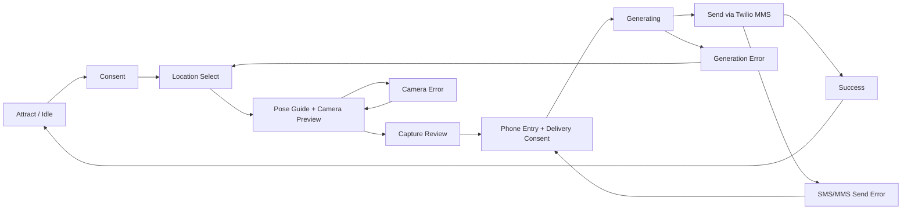

# vPRO Kiosk UI Wireframe (Low Fidelity)

## Purpose
This wireframe defines the primary kiosk experience screens for the local, OpenVINO-first, Twilio-MMS delivery flow.

## Screen Flow


## Global Layout Rules
- Full-screen kiosk layout, optimized for portrait 1080x1350.
- Touch-first controls with large targets and strong contrast.
- Persistent top-right support button for staff override.
- Session timeout resets to Idle screen.

## 1) Attract / Idle
Goal: invite visitors and explain the value in one glance.

```text
+--------------------------------------------------------------------------------+
| vPRO Travel Photo Experience                                    [Staff Button] |
|--------------------------------------------------------------------------------|
|                                                                                |
|                  Put yourself anywhere. Hold a vPro laptop.                   |
|                                                                                |
|                         [ Start Your Photo Experience ]                        |
|                                                                                |
|                 About 1 minute. Image delivered by text message.              |
|                                                                                |
+--------------------------------------------------------------------------------+
```

Notes:
- Loop subtle background animation or rotating sample outputs.
- Auto-return here after completion or inactivity.

## 2) Consent
Goal: capture clear consent and trust messaging.

```text
+--------------------------------------------------------------------------------+
| Consent                                                         [Staff Button] |
|--------------------------------------------------------------------------------|
| We capture your photo to generate your personalized image.                     |
| All image processing runs locally on this kiosk.                               |
| Your phone number is used only to deliver your image by text message.          |
| No automatic marketing enrollment.                                              |
|                                                                                |
| [ ] I agree to photo capture and image generation.                             |
|                                                                                |
| [ Cancel ]                                                  [ Accept & Continue ]|
+--------------------------------------------------------------------------------+
```

Validation:
- Continue disabled until checkbox selected.

## 3) Location Select
Goal: choose destination quickly.

```text
+--------------------------------------------------------------------------------+
| Choose Your Destination                                         [Staff Button] |
|--------------------------------------------------------------------------------|
| [ Search ____________________ ]         [ Region: All v ] [ Style: All v ]    |
|                                                                                |
| [ Cairo / Pyramids ] [ Tokyo Night ] [ Swiss Alps ] [ NYC Skyline ]           |
| [ Santorini ]        [ Paris ]       [ Dubai ]      [ Rio ]                   |
| [ Cape Town ]        [ Sydney ]      [ Seoul ]      [ Custom Event Set ]      |
|                                                                                |
| [ Back ]                                                     [ Continue ]       |
+--------------------------------------------------------------------------------+
```

Validation:
- Continue disabled until one location selected.

## 4) Pose Guide + Camera Preview
Goal: guide body position and hand placement for laptop prop.

```text
+--------------------------------------------------------------------------------+
| Strike the Pose                                                [Staff Button]  |
|--------------------------------------------------------------------------------|
| +-----------------------------------+   +------------------------------------+ |
| | Live Camera Feed                  |   | Pose Guide                          | |
| | (person preview with silhouette)  |   | 1. Stand in frame center            | |
| |                                   |   | 2. Raise one hand like a tray       | |
| | [outline + hand target marker]    |   | 3. Hold still on capture            | |
| +-----------------------------------+   +------------------------------------+ |
|                                                                                |
| [ Reposition ]                                     [ Capture ]                 |
+--------------------------------------------------------------------------------+
```

System behavior:
- Show live quality hints: low light, multiple people, out-of-frame.
- Use YOLO26 keypoints to validate hand visibility before enabling Capture.
- If multiple people are present, auto-select one primary subject (center-biased, highest-confidence) and show a non-blocking hint so users can reposition for cleaner results.

## 5) Capture Review
Goal: confirm the shot before processing.

```text
+--------------------------------------------------------------------------------+
| Review Your Photo                                             [Staff Button]   |
|--------------------------------------------------------------------------------|
|                         [ Captured image preview ]                              |
|                                                                                |
|           Looks good? This image will be composited in your scene.            |
|                                                                                |
| [ Retake ]                                                   [ Use This Photo ] |
+--------------------------------------------------------------------------------+
```

## 6) Phone Entry + Delivery Consent
Goal: collect number for Twilio MMS delivery.

```text
+--------------------------------------------------------------------------------+
| Send to Your Phone                                              [Staff Button] |
|--------------------------------------------------------------------------------|
| Enter your mobile number:                                                      |
| [ +1 (___) ___-____ ]                                                          |
|                                                                                |
| [ ] I consent to receive this one-time image delivery text message.            |
|                                                                                |
| Delivery only. No automatic marketing enrollment.                              |
|                                                                                |
| [ Back ]                                                     [ Send My Photo ]  |
+--------------------------------------------------------------------------------+
```

Validation:
- Button disabled until valid E.164-compatible number and consent checked.

## 7) Generating
Goal: reassure while local pipeline runs.

```text
+--------------------------------------------------------------------------------+
| Creating Your Image                                            [Staff Button]  |
|--------------------------------------------------------------------------------|
|                                                                                |
|                      [ Progress Ring / Bar: 0% ... 100% ]                     |
|                                                                                |
|  Running local AI pipeline: pose -> extraction -> composite -> enhancement     |
|                                                                                |
|                         Please keep this screen open.                          |
|                                                                                |
+--------------------------------------------------------------------------------+
```

## 8) Sending MMS
Goal: show send status clearly.

```text
+--------------------------------------------------------------------------------+
| Sending to Your Phone                                          [Staff Button]  |
|--------------------------------------------------------------------------------|
|                                                                                |
|                Sending your photo via text message now...                     |
|                                                                                |
|                 [ status: queued / sent / delivered ]                         |
|                                                                                |
+--------------------------------------------------------------------------------+
```

## 9) Success
Goal: close with delight and reset.

```text
+--------------------------------------------------------------------------------+
| Success!                                                      [Staff Button]   |
|--------------------------------------------------------------------------------|
|                                                                                |
|                   Your photo has been sent to your phone.                     |
|                                                                                |
|                   Thanks for trying the Intel vPro experience!                |
|                                                                                |
|                     Returning to home screen in 10 seconds...                 |
|                                                                                |
|                   [ Done Now ]                                                |
+--------------------------------------------------------------------------------+
```

## Error States

## E1) Camera Error
- Message: Camera unavailable. Please ask event staff.
- Actions: Retry Camera, Staff Override.

## E2) Generation Error
- Message: We could not generate your image this time.
- Actions: Retry Generation, Retake Photo, Choose Another Scene.

## E3) MMS Send Error
- Message: We could not send your message yet.
- Actions: Retry Send, Re-enter Number.

## E4) Timeout Reset
- Message: Session timed out. Returning to start.
- Action: Auto-return to Idle.

## Staff Controls (Hidden Panel)
- Reinitialize camera
- Reinitialize OpenVINO pipeline
- Twilio connectivity/send test
- View recent failed sessions
- Force return to Idle

## Wireframe-to-Build Mapping
- Attract, Consent, Select, Pose, Review, Phone, Generating, Sending, Success map 1:1 to frontend routes.
- Error states map to overlay modals with actionable retry buttons.
- All transitions should emit local telemetry events for completion-rate analysis.
